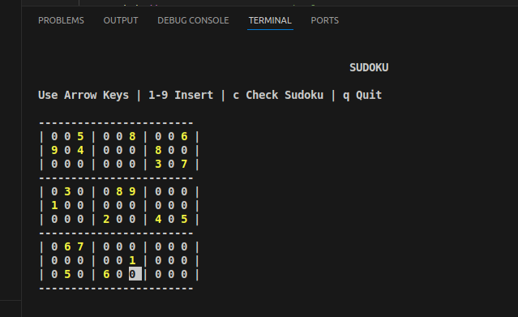

# 🧩 Terminal Sudoku (C++ + ncurses)

A colorful, interactive terminal-based Sudoku game built with **C++** and **ncurses**, featuring keyboard navigation, fixed-cell highlighting, and solution checking.

---

## 🎮 Features

- Arrow-key movement across the Sudoku board  
- Fixed cells highlighted in **yellow**  
- User-entered values shown in **cyan**  
- Press **c** to check if the Sudoku is solved  
- Press **q** to quit  
- Randomly generated initial Sudoku numbers  
- Colorful ncurses interface  

---

## 🛠 Requirements

Install ncurses:

```bash
sudo apt install libncurses5-dev libncursesw5-dev
```

---

## 📁 Project Structure

```
mysudoku/
├── main.cpp
├── sudoku.cpp
├── sudoku.h
├── images/
│   └── screenshot.png
└── README.md
```

---

## ▶️ How to Compile

```bash
g++ main.cpp sudoku.cpp -lncurses -o sudoku
```

---

## ▶️ How to Run

```bash
./sudoku
```

---

## 📝 Notes

- Make sure your terminal supports ncurses colors.  
- Works on Ubuntu, Debian, Pop!\_OS, and most Linux distros.

---

## 📸 Screenshot



---

## 📚 License  

MIT License — Feel free to modify and use!

